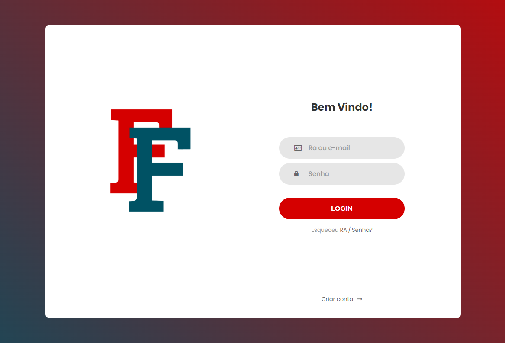

<!-- PROJECT LOGO -->
 

    
  </a>

  <h3 align="center">FalaFatec</h3>

  

    Repositório Web do projeto.
     
  

 
<!-- ABOUT THE PROJECT -->
## Sobre o projeto

    

Necessidade:
A ideia do projeto surgiu com a análise e experiência vivida dentro da FATEC São Caetano, onde foi possível observar a necessidade de um canal de comunicação mais prático, e a falta de conexão entre a comunidade da faculdade.

Objetivo:
Esse projeto busca criar um novo paradigma na comunicação interna de uma unidade FATEC, promovendo comunicação entre os alunos, corpo docente, setor administrativo e diretoria dessa unidade.

Benefícios:
* Proporcionar formas eficientes de comunicação entre as camadas que formam a comunidade FATEC;
* Agilizar ações de interesse comum entre as camadas que formam a comunidade FATEC;
* Possibilitar maior interessão entre cursos distintos de uma unidade FATEC.

(<a href="#readme-top">back to top</a>)

### Tecnologias

Aqui estão citadas as principais tecnologias que estão sendo utilizadas para o desenvolvimento desse projeto, existem mais informações de como a apicação delas está sendo feita no <a href="https://github.com/FalaFatec/AMS-ADS-GR-4-FALA-FATEC"><strong>repositório de código »</strong></a>

* ![Html][Html.com]
* ![Css][Css.com]
* [![Javascript][Javascript.com]][Javascript-url]
* [![Json][Json.com]][Json-url]
* [![Trello][Trello.com]][Trello-url]
* [![PostgreSQL][Postgre.com]][Postgre-url]
* [![Spring][Spring.com]][Spring-url]
* [![Postman][Postman.com]][Postman-url]
* [![IntelliJ][IntelliJ.com]][IntelliJ-url]
* [![VSCode][VisualStudioCode.com]][VisualStudioCode-url]

(<a href="#readme-top">back to top</a>)

<!-- CONTATO -->
## Contato

Your Name - [@your_twitter](https://twitter.com/your_username) - email@example.com

Project Link: [https://github.com/your_username/repo_name](https://github.com/your_username/repo_name)

(<a href="#readme-top">back to top</a>)

<!-- MARKDOWN LINKS & IMAGES -->
<!-- https://www.markdownguide.org/basic-syntax/#reference-style-links -->
[contributors-shield]: https://img.shields.io/github/contributors/othneildrew/Best-README-Template.svg?style=for-the-badge
[contributors-url]: https://github.com/FalaFatec/AMS-ADS-GR-4-DOC/graphs/contributors
[forks-shield]: https://img.shields.io/github/forks/othneildrew/Best-README-Template.svg?style=for-the-badge
[forks-url]: https://github.com/othneildrew/Best-README-Template/network/members
[stars-shield]: https://img.shields.io/github/stars/othneildrew/Best-README-Template.svg?style=for-the-badge
[stars-url]: https://github.com/othneildrew/Best-README-Template/stargazers
[issues-shield]: https://img.shields.io/github/issues/othneildrew/Best-README-Template.svg?style=for-the-badge
[issues-url]: https://github.com/othneildrew/Best-README-Template/issues
[license-shield]: https://img.shields.io/github/license/othneildrew/Best-README-Template.svg?style=for-the-badge
[license-url]: https://github.com/othneildrew/Best-README-Template/blob/master/LICENSE.txt
[linkedin-shield]: https://img.shields.io/badge/-LinkedIn-black.svg?style=for-the-badge&logo=linkedin&colorB=555
[linkedin-url]: https://linkedin.com/in/othneildrew
[product-screenshot]: images/screenshot.png
[Html.com]: https://img.shields.io/badge/HTML5-E34F26?style=for-the-badge&logo=html5&logoColor=white
[Css.com]: https://img.shields.io/badge/CSS3-1572B6?style=for-the-badge&logo=css3&logoColor=white
[Javascript.com]: https://img.shields.io/badge/JavaScript-323330?style=for-the-badge&logo=javascript&logoColor=F7DF1E
[Javascript-url]: https://www.javascript.com/
[Json.com]: https://img.shields.io/badge/json-5E5C5C?style=for-the-badge&logo=json&logoColor=white
[Json-url]: https://www.json.org/json-en.html
[Trello.com]: https://img.shields.io/badge/Trello-0052CC?style=for-the-badge&logo=trello&logoColor=white
[Trello-url]: https://trello.com/
[Postgre.com]: https://img.shields.io/badge/PostgreSQL-316192?style=for-the-badge&logo=postgresql&logoColor=white
[Postgre-url]: https://www.postgresql.org/
[Spring.com]: https://img.shields.io/badge/Spring-6DB33F?style=for-the-badge&logo=spring&logoColor=white
[Spring-url]: https://spring.io/projects/spring-boot
[Postman.com]: https://img.shields.io/badge/Postman-FF6C37?style=for-the-badge&logo=Postman&logoColor=white
[Postman-url]: https://www.postman.com/
[IntelliJ.com]: https://img.shields.io/badge/IntelliJ_IDEA-000000.svg?style=for-the-badge&logo=intellij-idea&logoColor=white
[IntelliJ-url]: https://www.jetbrains.com/idea/
[VisualStudioCode.com]: https://img.shields.io/badge/VSCode-0078D4?style=for-the-badge&logo=visual%20studio%20code&logoColor=white
[VisualStudioCode-url]: https://code.visualstudio.com/
